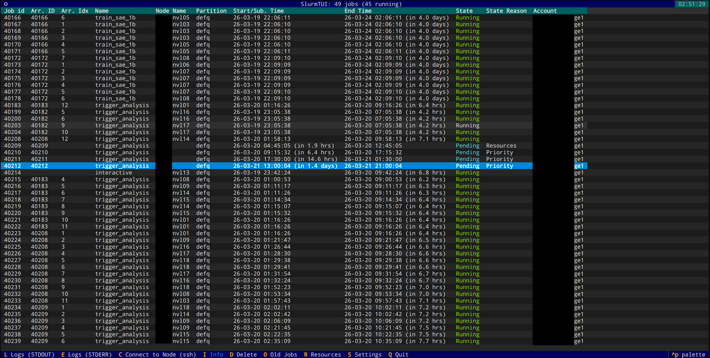
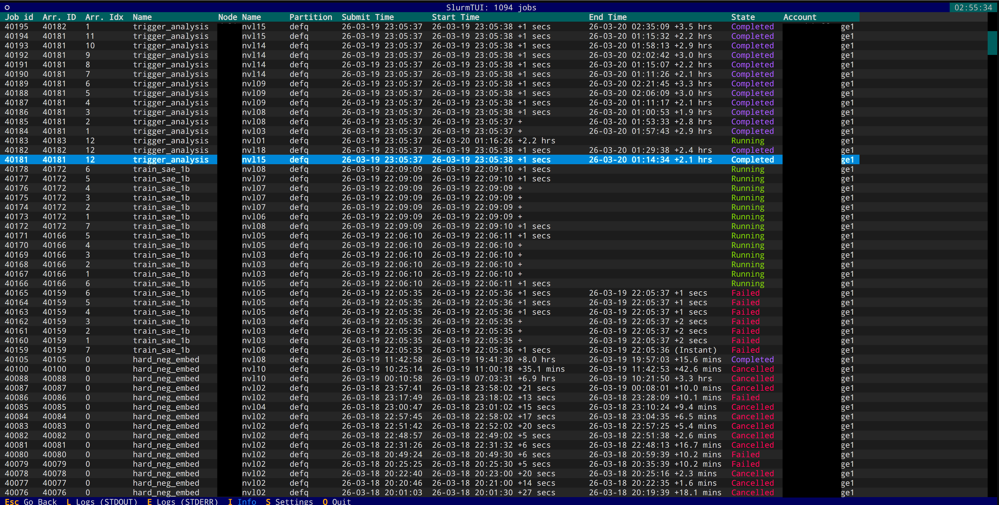
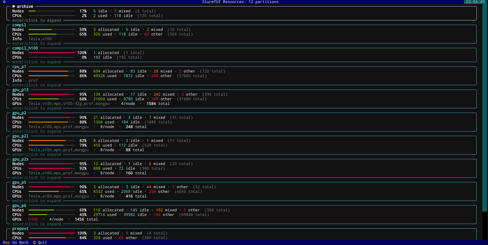

During my PhD, I spent a lot of time running experiments on large HPC clusters, we're talking thousands of GPU and CPU nodes, massive hyperparameter sweeps, and job arrays that would balloon into hundreds of entries in the queue. If you've ever had to babysit Slurm jobs by repeatedly typing `squeue -u $USER` and squinting at the output, you know the pain.

The existing options were either too barebones (raw Slurm commands) or too heavy (web-based dashboards that the cluster admins may or may not have set up). I wanted something I could just SSH into any login node and run immediately, so I built [SlurmTUI](https://github.com/WissamAntoun/SlurmTUI).

## What is it?

SlurmTUI is a terminal user interface for monitoring and managing Slurm jobs. Instead of running `squeue`, `sacct`, and `scancel` over and over, you get a live-updating table of your jobs with colors, sorting, filtering, and a bunch of shortcuts to do things like tail logs, SSH into nodes, or delete jobs, all without leaving the TUI.

It's built with Python using [Textual](https://textual.textualize.io/) and [Rich](https://rich.readthedocs.io/), so it looks pretty good for a terminal app and installs with a simple `pip install slurmtui`.

## Features

### Live Job Table

The main view auto-refreshes every few seconds, showing all your user jobs with colored states (green for running, red for failed, etc.). Filter jobs by account, partition, or any column when you have hundreds of jobs in the queue.

Note: To view all users' jobs, launch with `slurmtui --check_all_jobs` or filter by account with `slurmtui --acc my_account1,my_account2`.

Additional features include:

- **Tail Logs**: Press `L` for stdout, `E` for stderr, directly from the TUI. You can configure it to use `tail -f`, `less`, or any command you want. YOu can also configure secondary text viewers which can be actiavted with `Ctrl+L` and `Ctrl+E`.
- **SSH into Nodes**: Press `C` to SSH into the node where your job is running. No more copy-pasting node names.
- **Delete Jobs**: Press `D` to delete a job with confirmation. Works with array jobs too.
- **View Job Info**: Press `I` to see detailed job info.



### Old Jobs History

View completed/failed job history via `sacct` (needs Slurm 24.05+). Press `O` to toggle.



### Hardware Resources View

See node allocation and availability across the cluster instead of squinting at `sinfo` output. Press `R` to open.



### Persistent Settings

All your preferences are stored in `~/.config/slurmtui/settings.json`, so they persist across sessions.

The keybindings are straightforward, `L` for logs, `D` for delete, `C` for connect, `I` for job info, `O` for old jobs, `R` for resources. No need to memorize anything complicated.

## Installation

```bash
pip install slurmtui
```

Then just run slurmtui (or the shorter aliases slurmui / sui).


It needs Slurm 21.08+ because it relies on squeue --json for structured output.


You can filter by account at launch:

```bash
slurmtui --acc my_account1,my_account2
```

View all users' jobs:

```bash
slurmtui --check_all_jobs
```

Or pass extra squeue arguments:

```bash
slurmtui -- --partition=gpu
```

## Closing thoughts

This started as a quick script to make my own life easier and grew into something that other people on the cluster started using too. It's not trying to replace a full cluster management tool, it's just a lightweight way to keep track of your jobs without context-switching away from the terminal.

The code is on GitHub under MIT license. If you spend your days staring at Slurm queues, give it a try, and a star on GitHub would be much appreciated! If you have any feature requests or want to contribute, the repo is open for PRs. Happy job managing!
